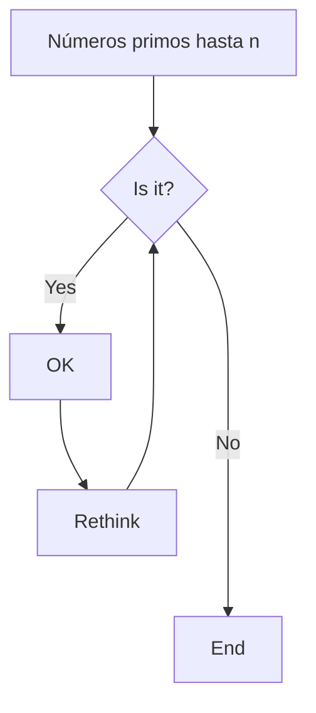

# algoritmos-reto-4


```mermaid
graph TD
A[Números primos hasta n] --> B{Is it?}
B -- Yes --> C[OK]
C --> D[Rethink]
D --> B
B -- No ----> E[End]
```

```mermaid
graph TD
A[Hallar la raíz cuadrada de un número] --> B[Separa los dígitos en dos]
B --> C[jaja]
