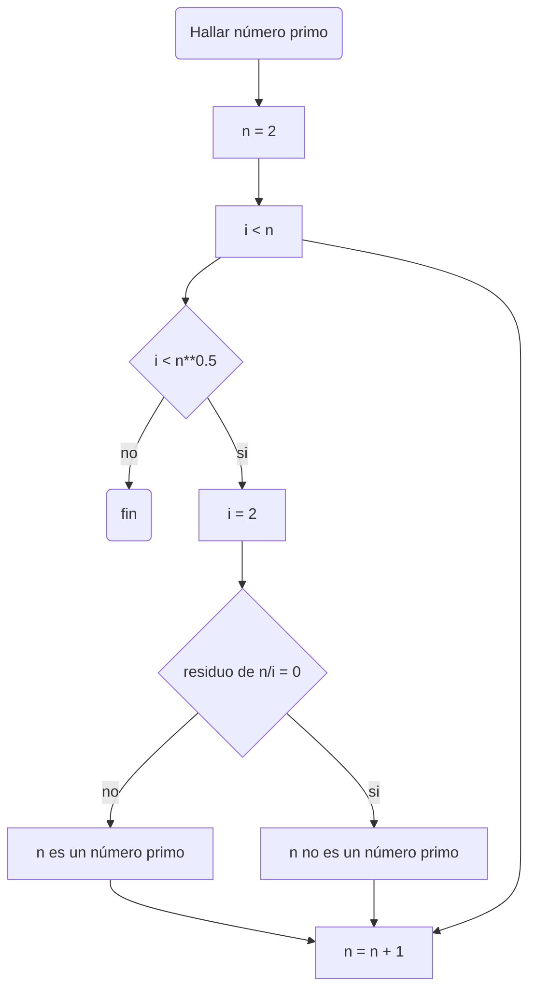

# Reto #4
Algoritmos

## Números primos hasta n

A continuación se presentará el pseudocódigo propuesto por mi persona para obtener números primos.
```sh
[variables]
n : entero
i : entero
x: entero
inicio
  i: = 2
  mientras (i < n)
    If (i < n**0.5) hacer
      (residuo de n/i)
         If hay residuo de n/i
           (n no es un número primo)
         else hacer
           (i = i + 1)
         Fin mientras  
    else
      (n es un número primo)
fin      
```

Ahora el algoritmo presentado anteriormente para hallar números primos se mostrará en forma de diagrama de flujo

