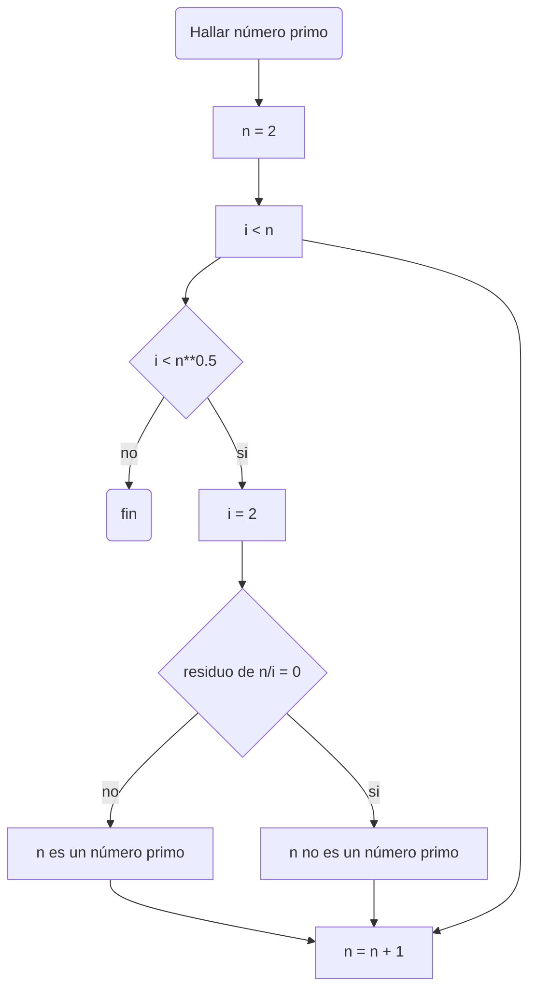

# Reto #4
Algoritmos

## Números primos hasta n

A continuación se presentará el pseudocódigo propuesto por mi persona para obtener números primos.
```sh
[variables]
n : entero
i : entero
x: entero
inicio
  i: = 2
  mientras (i < n)
    If (i < n**0.5) hacer
      (residuo de n/i)
         If hay residuo de n/i
           (n no es un número primo)
         else hacer
           (i = i + 1)
         Fin mientras  
    else
      (n es un número primo)
fin      
```

Ahora el algoritmo presentado anteriormente para hallar números primos se mostrará en forma de diagrama de flujo


## Hallar raíz cuadrada

Para hallar la raíz cuadrada de un número se debe realizar el siguiente proceso, expresado a continuación mediante un pseudocódigo de Markdown.

```sh
[variables]
x : entero 
i : entero
z : float
inicio
 print x ("Ingrese un número positivo")
 hacer if len(lista_cifras) % 2!= 0 #agrupamos de a dos las cifras del número x
 hacer i (número que el cuadrado se aproxime al primer par sin pasarse)
 escribir (2 * i) #en nuevo renglón
 par_actual = concatenar(num1, num2)  // formar el siguiente par de dígitos
 resultado = x * (x + 1)
   Si (no hay residuo) entonces
     (z) encontrado #hallamos la raíz
   else
   mientras (condición no se cumpla) hacer
     instrucciones a repetir
```

Ahora bien al igual que para hallar números primos, se presenta el diagrama de flujo en cual se evidencian los pasos a seguir para encontrar raices cuadradas usando el método de sucesiones.

```mermaid
flowchart TD
    A(Hallar la raíz cuadrada de un número) --> B[agrupar de a dos dígitos las cifras del radicando]
    B --> C[el número que el cuadrado se aproxime al primer par sin pasarse se ubica en la raíz]
    C --> D[restamos el cuadrado del primer número de la raízcon la primer pareja]
    D --> E{Hay residuo?}
    E --> |no| P(Raíz cuadrada hallada)
    E --> |si| F[se escribe el doble de la raíz en un nuevo renglón y se bajan los siguientes dígitos]
    F --> G[buscar un número que contenga el primer dígito del segundo renglón y que al multiplicarlo por el segundo se aproxime por abajo al residuo]
    G --> U[se resta con el residuo]
    U --> H{Hay residuo?}
    H --> |no| P
    H --> |si| F 
